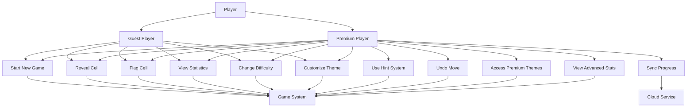
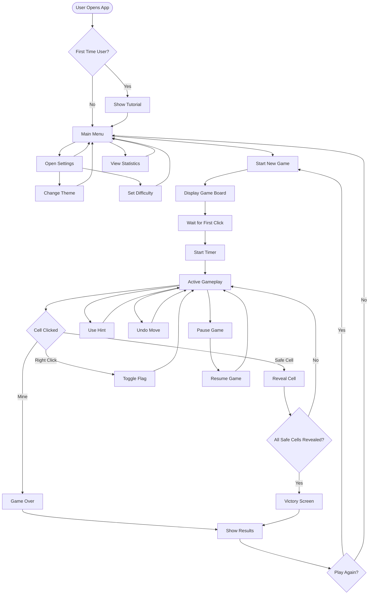

# Requirements Analysis Report
## Modern Minesweeper Game Development

### 1. Consolidated Stakeholder Requirements (Structured Document)

#### Primary Stakeholder Needs:
- **Game Type**: Classic Minesweeper with modern enhancements
- **Learning Curve**: Easy to learn, difficult to master
- **Visual Design**: Modern aesthetic with clean, simple interface
- **Platform Coverage**: Cross-platform availability (PC, Mac, mobile devices)
- **User Experience**: Intuitive gameplay with contemporary design elements

### 2. Functional Requirements Specification

#### FR-001: Core Game Mechanics
- The system shall implement traditional Minesweeper gameplay rules
- The system shall generate random mine placement for each new game
- The system shall allow users to reveal cells by clicking/tapping
- The system shall allow users to flag suspected mine locations
- The system shall detect win/lose conditions automatically

#### FR-002: Modern Game Features
- The system shall provide multiple difficulty levels (Beginner, Intermediate, Expert, Custom)
- The system shall include a hint system for learning players
- The system shall offer undo functionality (limited uses per game)
- The system shall provide game statistics and progress tracking
- The system shall support custom board sizes and mine counts

#### FR-003: User Interface
- The system shall display a clean, minimalist game board
- The system shall show mine counter and timer
- The system shall provide visual feedback for user interactions
- The system shall include settings menu for customization
- The system shall support both light and dark themes

#### FR-004: Cross-Platform Features
- The system shall save game progress across devices
- The system shall synchronize user statistics and achievements
- The system shall support touch controls on mobile devices
- The system shall adapt UI layout for different screen sizes

### 3. Non-Functional Requirements Specification

#### NFR-001: Performance Requirements
- Game startup time shall not exceed 3 seconds
- Cell reveal response time shall be under 100ms
- Memory usage shall not exceed 100MB on mobile devices
- Battery consumption shall be optimized for mobile gameplay

#### NFR-002: Usability Requirements
- New users shall be able to start playing within 30 seconds
- Interface elements shall be accessible to users with disabilities
- Touch targets on mobile shall be minimum 44px for comfortable interaction
- Game shall provide clear visual indicators for all interactive elements

#### NFR-003: Compatibility Requirements
- Support for Windows 10+, macOS 10.14+, iOS 12+, Android 8+
- Responsive design for screen sizes from 4" to 32"
- Support for keyboard, mouse, and touch input methods
- Offline gameplay capability with optional online features

#### NFR-004: Security Requirements
- User data shall be encrypted during transmission and storage
- No collection of personally identifiable information without consent
- Secure authentication for cloud save features
- Regular security updates and vulnerability assessments

### 4. Business Requirements Document

#### BR-001: Market Positioning
- Target casual gaming market with premium experience
- Differentiate through modern design and enhanced features
- Appeal to both nostalgic players and new gaming audience

#### BR-002: Revenue Model
- Freemium model with basic game free
- Premium features: unlimited hints, custom themes, advanced statistics
- Optional cosmetic purchases: board themes, animation effects
- No pay-to-win mechanics to maintain game integrity

#### BR-003: Platform Strategy
- Simultaneous launch on all major platforms
- App store optimization for discoverability
- Cross-platform progression to increase user retention

#### BR-004: Success Metrics
- Target 100K downloads in first 3 months
- Maintain 4.0+ rating across all app stores
- Achieve 30% monthly active user retention rate
- Generate sustainable revenue through premium features

### 5. User Requirements Document

#### UR-001: Casual Gamers
- Quick gameplay sessions (5-15 minutes)
- Easy difficulty options for stress-free experience
- Clear tutorials and help system
- Progress saving for interrupted sessions

#### UR-002: Experienced Players
- Challenging difficulty levels and custom configurations
- Advanced statistics and leaderboards
- Speed-run modes and time challenges
- Achievement system for long-term engagement

#### UR-003: Mobile Users
- One-handed gameplay option
- Optimized battery usage
- Offline play capability
- Quick resume functionality

#### UR-004: Accessibility Users
- Screen reader compatibility
- High contrast mode
- Adjustable text sizes
- Alternative input methods support

### 6. Mermaid Use Case Diagram Code

### 7. List of User Stories

#### Epic: Core Gameplay
**US-001**: As a player, I want to start a new Minesweeper game so that I can begin playing immediately.
- **Acceptance Criteria**: 
  - Game board generates within 2 seconds
  - Mines are randomly distributed
  - Timer starts on first cell reveal

**US-002**: As a player, I want to reveal cells by clicking/tapping so that I can progress through the game.
- **Acceptance Criteria**:
  - Single click/tap reveals cell
  - Numbers show adjacent mine count
  - Empty cells auto-reveal adjacent cells

**US-003**: As a player, I want to flag suspected mines so that I can mark dangerous areas.
- **Acceptance Criteria**:
  - Right-click or long-press places flag
  - Flag counter updates correctly
  - Flagged cells cannot be accidentally revealed

#### Epic: Modern Features
**US-004**: As a learning player, I want access to hints so that I can improve my skills.
- **Acceptance Criteria**:
  - Hint button highlights safe cell
  - Limited hints per game for free users
  - Hint usage tracked in statistics

**US-005**: As a player, I want to undo my last move so that I can correct mistakes.
- **Acceptance Criteria**:
  - Undo button available after each move
  - Limited undos per game
  - Game state restored accurately

#### Epic: User Experience
**US-006**: As a mobile user, I want touch-optimized controls so that I can play comfortably on my device.
- **Acceptance Criteria**:
  - Touch targets minimum 44px
  - Gesture support for flagging
  - One-handed play mode available

**US-007**: As a player, I want to choose between light and dark themes so that I can customize my experience.
- **Acceptance Criteria**:
  - Theme selection in settings
  - Immediate theme switching
  - Theme preference saved

#### Epic: Progression
**US-008**: As a competitive player, I want to see my game statistics so that I can track my improvement.
- **Acceptance Criteria**:
  - Win/loss ratio displayed
  - Best times per difficulty
  - Games played counter

**US-009**: As a premium user, I want my progress synced across devices so that I can continue playing anywhere.
- **Acceptance Criteria**:
  - Statistics sync automatically
  - Settings preserved across devices
  - Offline play with later sync

### 8. Mermaid User Flow Diagram Code

