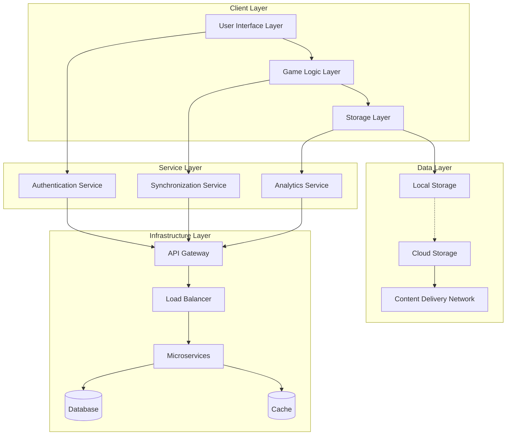
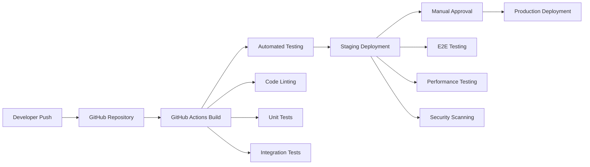

# System Architecture Design Document
## Modern Minesweeper Game Development

### High-Level Architecture Diagram



### Component Architecture Diagram

```mermaid
graph TB
    subgraph "Frontend Components"
        subgraph "UI Layer"
            GBC[Game Board Component]
            MC[Menu Component]
            SC[Settings Component]
            STC[Statistics Component]
            TC[Theme Component]
        end
        
        subgraph "Game Engine"
            GM[Game Manager]
            MFG[Mine Field Generator]
            GS[Game State Manager]
            HE[Hint Engine]
            UE[Undo Engine]
        end
        
        subgraph "Services"
            IS[Input Service]
            RS[Renderer Service]
            AS[Audio Service]
            TS[Theme Service]
            PS[Persistence Service]
        end
    end
    
    subgraph "Backend Services"
        subgraph "User Services"
            AUTH[Authentication API]
            PROFILE[User Profile API]
            PREFS[Preferences API]
        end
        
        subgraph "Game Services"
            STATS[Statistics API]
            ACHIEVE[Achievement API]
            SYNC[Sync API]
        end
        
        subgraph "Platform Services"
            ANALYTICS[Analytics API]
            CRASH[Crash Reporting]
            CONFIG[Remote Config]
        end
    end
    
    subgraph "Data Storage"
        LOCALDB[(Local Database)]
        CLOUDDB[(Cloud Database)]
        REDIS[(Redis Cache)]
        S3[(File Storage)]
    end
    
    GBC --> GM
    MC --> GM
    SC --> PS
    STC --> STATS
    
    GM --> MFG
    GM --> GS
    GM --> HE
    GM --> UE
    
    IS --> GM
    RS --> GBC
    AS --> GM
    TS --> TC
    PS --> SYNC
    
    AUTH --> CLOUDDB
    PROFILE --> CLOUDDB
    PREFS --> REDIS
    STATS --> CLOUDDB
    ACHIEVE --> CLOUDDB
    SYNC --> CLOUDDB
    
    PS --> LOCALDB
    SYNC --> S3
    CONFIG --> REDIS
```



### Technology Stack Description

#### Frontend Technologies

**Core Framework Selection:**
- **React Native (Mobile)**: Chosen for cross-platform mobile development with native performance
  - Version: 0.72+
  - Advantages: Single codebase, native UI components, excellent performance
  - Libraries: React Navigation, React Native Gesture Handler, React Native Async Storage

- **Progressive Web App (Desktop/Web)**: React-based PWA for desktop and web browsers
  - Version: React 18+
  - Advantages: Universal compatibility, offline capabilities, app-like experience
  - Libraries: React Router, Material-UI, Workbox for service worker management

**Game Engine Layer:**
- **TypeScript**: Primary development language for type safety and maintainability
  - Version: 5.0+
  - Benefits: Enhanced IDE support, compile-time error detection, better code documentation

- **Custom Game Engine**: Purpose-built lightweight engine optimized for Minesweeper
  - Canvas-based rendering for smooth animations
  - Efficient state management with immutable data structures
  - Modular architecture for easy testing and maintenance

**UI/UX Framework:**
- **React Native Elements (Mobile)**: Consistent cross-platform UI components
- **Material Design 3**: Modern design system implementation
- **Styled Components**: CSS-in-JS for dynamic theming and responsive design

#### Backend Technologies

**Runtime Environment:**
- **Node.js**: Version 18 LTS for server-side JavaScript execution
  - Benefits: JavaScript ecosystem consistency, excellent performance, large community

**Web Framework:**
- **Express.js**: Lightweight and flexible web application framework
  - Version: 4.18+
  - Middleware: Helmet for security, Morgan for logging, Compression for response optimization

**Database Technologies:**
- **Primary Database - PostgreSQL**: Version 15+
  - User profiles, game statistics, achievements
  - ACID compliance for data integrity
  - Excellent performance for complex queries

- **Cache Layer - Redis**: Version 7+
  - Session management, frequently accessed data caching
  - Real-time leaderboards and statistics
  - Pub/Sub for real-time features

- **Object Storage - AWS S3**: Game assets, user-generated content
  - CloudFront CDN integration for global content delivery
  - Versioning and backup capabilities

**Authentication & Security:**
- **JSON Web Tokens (JWT)**: Stateless authentication mechanism
- **bcrypt**: Password hashing with salt rounds
- **OAuth 2.0**: Integration with Google, Apple, and Facebook login
- **Rate Limiting**: Express-rate-limit for API protection

#### Infrastructure Technologies

**Cloud Platform:**
- **Amazon Web Services (AWS)**: Primary cloud infrastructure provider
  - Global availability and reliability
  - Comprehensive service ecosystem
  - Cost-effective scaling options

**Container Orchestration:**
- **Docker**: Application containerization
  - Version: 24+
  - Benefits: Consistent deployment environments, easy scaling

- **Amazon ECS**: Container orchestration service
  - Auto-scaling based on demand
  - Integration with other AWS services
  - Cost-effective compared to Kubernetes for this scale

**API Gateway & Load Balancing:**
- **AWS Application Load Balancer**: Layer 7 load balancing
- **AWS API Gateway**: Request routing, throttling, and monitoring
- **CloudFront**: Global content delivery network

**Monitoring & Analytics:**
- **AWS CloudWatch**: Infrastructure and application monitoring
- **Sentry**: Error tracking and performance monitoring
- **Google Analytics**: User behavior analytics
- **Custom Analytics Pipeline**: Game-specific metrics collection

### Infrastructure Plan

#### Development Environment Architecture

**Local Development:**
```
Developer Workstation
├── Frontend (React Native/PWA)
│   ├── Metro Bundler (React Native)
│   ├── Webpack (PWA)
│   └── Local Storage Simulation
├── Backend Services
│   ├── Node.js Express Server
│   ├── Local PostgreSQL Instance
│   ├── Local Redis Instance
│   └── Mock AWS Services (LocalStack)
└── Development Tools
    ├── ESLint + Prettier
    ├── Jest Testing Framework
    ├── Flipper (React Native Debugging)
    └── Postman (API Testing)
```

**CI/CD Pipeline:**


#### Production Environment Architecture

**High Availability Setup:**
- **Multi-AZ Deployment**: Services distributed across 3 availability zones
- **Auto Scaling Groups**: Automatic scaling based on CPU, memory, and request metrics
- **Database Clustering**: PostgreSQL with read replicas for improved performance
- **Redis Clustering**: High availability cache with automatic failover

**Scalability Planning:**
```
Traffic Tier          | Users        | Infrastructure
---------------------|--------------|------------------
Tier 1 (Launch)     | 0-10K        | 2 EC2 instances, 1 DB instance
Tier 2 (Growth)     | 10K-100K     | 4 EC2 instances, 2 DB instances
Tier 3 (Scale)      | 100K-1M      | Auto-scaling group, DB cluster
Tier 4 (Enterprise) | 1M+          | Multi-region deployment
```

**Security Implementation:**
- **Network Security**: VPC with private subnets, security groups, NACLs
- **Data Encryption**: TLS 1.3 in transit, AES-256 at rest
- **Access Control**: IAM roles with least privilege principle
- **Compliance**: GDPR and mobile app store guidelines compliance

**Backup & Disaster Recovery:**
- **Database Backups**: Automated daily backups with 30-day retention
- **Point-in-Time Recovery**: 35-day backup retention for PostgreSQL
- **Cross-Region Replication**: Critical data replicated to secondary region
- **Recovery Time Objective (RTO)**: 4 hours maximum downtime
- **Recovery Point Objective (RPO)**: 1 hour maximum data loss

**Performance Optimization:**
- **CDN Strategy**: Global CloudFront distribution for static assets
- **Caching Layers**: Multi-level caching (Browser → CDN → Redis → Database)
- **Database Optimization**: Indexed queries, connection pooling, read replicas
- **Asset Optimization**: Image compression, code splitting, lazy loading

**Monitoring & Alerting:**
```
Monitoring Stack:
├── Infrastructure Metrics (CloudWatch)
│   ├── CPU, Memory, Network utilization
│   ├── Request rates and response times
│   └── Error rates and availability
├── Application Metrics (Custom)
│   ├── Game completion rates
│   ├── User engagement metrics
│   └── Feature usage statistics
├── User Experience Metrics
│   ├── App startup time
│   ├── Game loading performance
│   └── Crash rates and error frequency
└── Business Metrics
    ├── Daily/Monthly Active Users
    ├── Revenue and conversion rates
    └── User retention metrics
```

**Cost Optimization Strategy:**
- **Reserved Instances**: 1-year reserved instances for baseline capacity
- **Spot Instances**: For non-critical batch processing workloads
- **Auto Shutdown**: Development environments auto-shutdown after hours
- **Storage Lifecycle**: Automatic transition to cheaper storage classes
- **Resource Right-Sizing**: Regular review and optimization of instance sizes

This comprehensive architecture provides a robust, scalable, and maintainable foundation for the Modern Minesweeper game, ensuring excellent user experience across all platforms while supporting business growth and technical excellence.